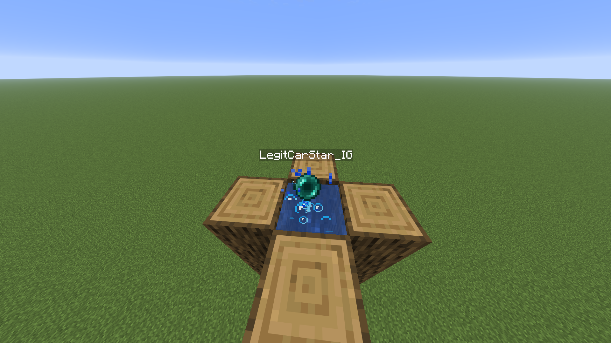
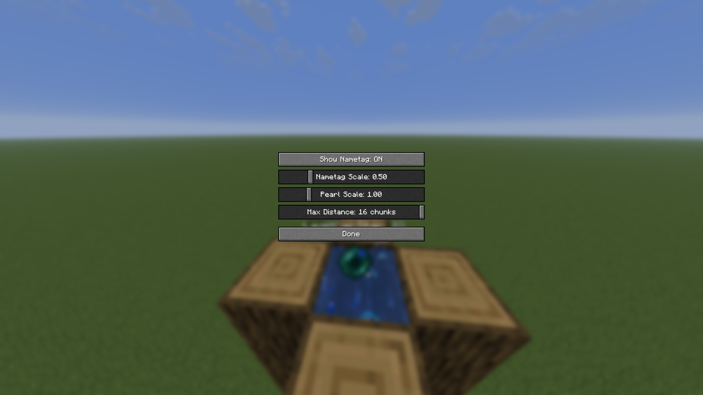

# [Pearls+](https://modrinth.com/mod/pearl-plus) (Fabric 1.21.11)

## Overview
**Pearls+** is a lightweight **Fabric mod** for Minecraft **1.21.11** that enhances the Ender Pearl experience by displaying the **thrower's name** (as a nametag) when an Ender Pearl is launched. This mod is **client-side only**, meaning it works in single-player and multiplayer without requiring server-side installation.

---

## Features

### 1. **Thrower Nametag**
- A **floating nametag** appears above the Ender Pearl, displaying the **username** of the player who threw it.
- Useful in multiplayer to identify who is launching pearls (in combat/stasis chamber).
- The thrower's name is cached the moment it's first resolved, so the nametag survives the owner briefly dropping out of tracking range or relogging - it won't disappear

### 2. **Mod Menu Configuration**
- If [Mod Menu](https://github.com/TerraformersMC/ModMenu) is installed, Pearls+ adds a config screen with:
  - **Show Nametag** - toggle the nametag on/off.
  - **Nametag Scale** - adjust how large the nametag renders.
  - **Max Distance** - control how far away the nametag stays visible.

---

## Requirements
- **Minecraft Version**: 1.21.11
- **Java**: 21+
- **Fabric Loader**: ≥0.19.0
- **Fabric API**: [Fabric API ](https://github.com/FabricMC/fabric-api)latest release for 1.21.11
- **Mod Menu**:[Mod Menu ](https://github.com/TerraformersMC/ModMenu) required only for the in-game config screen
---

## Installation
1. Download the latest `.jar` file from https://modrinth.com/mod/pearl-plus
2. Place it in your `mods/` folder (located in your Minecraft directory).
3. Launch the game using the **Fabric** profile.

---

## 📜 License
This mod is released under the **MIT License**. Feel free to modify or redistribute it, but credit is appreciated!

---

## Screenshots

- **Nametag Display**: 
- **Nametag Display**: 

---

**Enhance your Ender Pearl game with Pearls+!**
